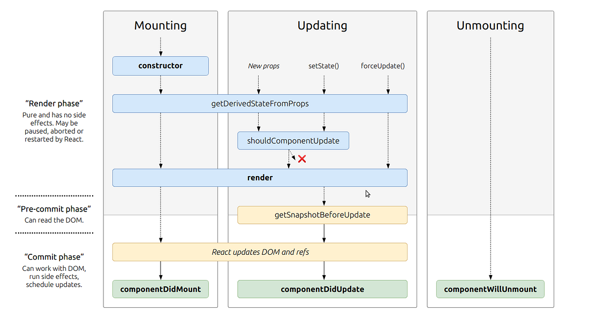

# Class 02 - State and Props

## React Lifecycle

In the above diagram it is shown that the 'render' happens before 'componentDidMount' and the first stage of the React lifestyle is the calling of the constructor function associated with a component.

The sequence of some key moments in the React lifecycle:

Constructor -> render -> React updates -> componentDidMount -> componentWillUnmount

The componentDidMount method is invoked after a component is mounted and is often used to set up API calls and other things that need to be done after the web page is rendered.

## State vs Props

The Props object is used to store static data that isn't going to change such as the heading of a page for instance. Props are passed to components where as state is controlled from within a component and is used to store data that is going to be updated. Applications are re-rendered whenever there are changes to the state or props of a component. An example of something that should be stored in state is a variable that tracks a user's score in a game or the elapsed time in a stop watch app.
